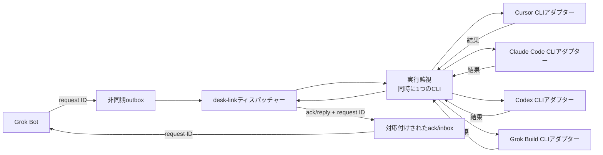

[English](README.md) | [日本語](README.ja.md)

# desk-link

Grok Botはdesk-linkを通じてCursor、Claude Code、Codex、Grok Buildへ依頼を送り、対応する返答をそれぞれ受け取ります。

## これは何か

desk-linkは、4つのAI開発エージェントCLIを対象にしたローカルの依頼・応答ブリッジです。ディスパッチャーは、キューの依頼を1件ずつ選択したCLIへ渡し、結果を記録する単一のプログラムです。

## これは何ではないか

desk-linkは、依頼ごとに新しいヘッドレス・非対話のCLI実行を開始します。製品標準のセッション間メッセージングではなく、すでに開いているUIチャットやセッションへメッセージを挿入しません。

## アーキテクチャ



キュー境界は非同期のため、依頼の送信と取得は別の手順です。ディスパッチャーが依頼を1件取得し、実行監視がアダプターを1つずつ実行します。CLIが終了すると、ディスパッチャーが確認結果と返答を記録します。

[アーキテクチャ詳細](docs/architecture.ja.md)と[メッセージプロトコル](docs/protocol.ja.md)を参照してください。

## 対応先

| 対象 | CLI | 現在の実行動作 |
| --- | --- | --- |
| Cursor | `cursor-agent` | 標準入力のプロンプトを読み取り専用のaskモードで実行。macOS／Linuxではsandboxを有効にし、ネイティブWindowsでは利用できないsandboxを明示的に無効化 |
| Claude Code | `claude` | 標準入力のプロンプトを、`--safe-mode`、空の組み込みツール集合、`dontAsk`、セッション永続化なしで実行 |
| Codex | `codex exec` | 標準入力のプロンプトを、ユーザー設定とルールを無視する一時的な読み取り専用モードで実行 |
| Grok Build | `grok` | UTF-8プロンプトファイルと`dontAsk`を使い、すべてのモデルツールを拒否し、Web検索・サブエージェント・メモリーを無効化して読み取り専用プロファイルで実行し、自動更新を無効化 |

ネイティブWindowsでは、現在のCursor CLIがsandboxを利用できないと報告します。そのためdesk-linkは、Cursorの読み取り専用askモードを使い、`--sandbox disabled`を指定します。これはベンダーが提供する読み取り専用境界であり、OSによる隔離ではありません。macOS／Linuxでは`--sandbox enabled`を指定します。

Windows版Grok CLIにはOSレベルのサンドボックスバックエンドがありません。モデルツール呼び出しは拒否されますが、OSによる隔離と通常のCLI起動・設定・セッション動作はベンダーの管理範囲です。

Claude Codeのsafe modeは、ベンダー側の認証・モデル選択・権限を維持します。このメッセージ専用境界では、`CLAUDE.md`、スキル、プラグイン、フック、MCPサーバー、コマンド、エージェント、カスタマイズを無効にします。

## クイックスタート

前提条件は、`py -3`として使えるPython 3と、各対象CLIが導入済みで認証済みであることです。Cursorでは`cursor-agent login`を実行した後、対象ワークスペースで`cursor-agent`を一度起動し、Workspace Trustを許可します。desk-linkは認証情報を読み取り・管理せず、次のコマンドはdesk-linkディレクトリで実行します。

```powershell
# 利用可能な会話更新を1回読み取る。
py -3 watch.py --once

# cursor、claude、codex、grok-buildから1つ選び、依頼を送る。
$target = "cursor"
$prompt = "受信したことを1文で返答してください。"
$prompt | py -3 bridge.py ask --to $target

# outboxで待機している依頼を1件処理する。
py -3 bridge.py run --once
```

`ask`は依頼を追加してから同期処理します。すでに依頼がキューにある場合は`run --once`を使います。

## メッセージと制限

各依頼と返答にはrequest IDがあり、確認結果と返答を元の依頼へ対応付けます。JSONLは1行に1つのJSONオブジェクトを記録するテキスト形式です。

bridgeとPhase 0イベントの項目と例は、[プロトコルリファレンス](docs/protocol.ja.md)にあります。

デーモンや自動起動はありません。各アダプターが新しいCLI実行を開始するため、既存セッションへの配信は利用できません。

## トラブルシューティング

### CLIが見つからない、または認証されていない

依頼を送る前に、選択したベンダーCLIを導入して認証してください。desk-linkはCLIを導入せず、認証情報を確認・保存・管理しません。

### CursorにWorkspace Trustを求められる

対象ワークスペースから`cursor-agent`を対話起動し、Workspace Trustを許可してから対話セッションを終了します。その後の非対話依頼はdesk-linkが起動できます。

### 開いているUIセッションにメッセージが表示されない理由

すべての依頼は、新しいヘッドレス・非対話のCLI実行を開始します。desk-linkは既存のUIチャットや製品標準セッションへメッセージを挿入しません。

## テストと構成

テストスイートは次のコマンドで実行します。

```powershell
py -3 -m unittest discover -s tests -v
```

| パス | 役割 |
| --- | --- |
| `bridge.py` | ディスパッチャーとCLIアダプター |
| `watch.py` | 1回または継続して会話更新を読み取る処理 |
| `tests/` | watcher、ディスパッチャー、アダプターの自動確認 |
| `docs/` | アーキテクチャとプロトコルのリファレンス |
