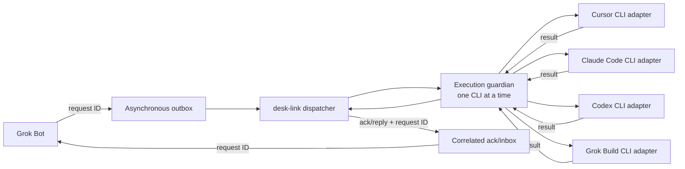

[English](README.md) | [日本語](README.ja.md)

# desk-link

Grok Bot sends requests through desk-link to Cursor, Claude Code, Codex, and Grok Build, then receives the corresponding reply from each.

## What it is

desk-link is a local request-and-reply bridge for four AI coding agent CLIs. A dispatcher is the single program that takes one queued request to the selected CLI and records its result.

## What it is not

desk-link starts a new headless, non-interactive CLI execution for every request. It is not native product session-to-session messaging and does not insert messages into an already-open UI chat or session.

## Architecture



Queue boundaries are asynchronous, so submitting and picking up a request are separate steps. The dispatcher claims one request, and its execution guardian invokes one adapter at a time. The dispatcher records the acknowledgement and reply after that CLI returns.

See [architecture details](docs/architecture.md) and the [message protocol](docs/protocol.md).

## Supported targets

| Target | CLI | Current execution behavior |
| --- | --- | --- |
| Cursor | `cursor-agent` | Sends the prompt on standard input in read-only ask mode; enables sandbox on macOS/Linux and explicitly disables the unavailable sandbox on native Windows |
| Claude Code | `claude` | Sends the prompt on standard input with `--safe-mode`, an empty built-in tool set, `dontAsk`, and no session persistence |
| Codex | `codex exec` | Sends the prompt on standard input in ephemeral, read-only mode while ignoring user configuration and rules |
| Grok Build | `grok` | Uses a UTF-8 prompt file with `dontAsk`, denies all model tools, disables web search, subagents, and memory, uses a read-only profile, and disables auto-update |

On native Windows, the current Cursor CLI reports its sandbox as unavailable. desk-link therefore uses Cursor's read-only ask mode and passes `--sandbox disabled`. This is a vendor-enforced read-only boundary, not operating-system containment. On macOS and Linux, desk-link requests `--sandbox enabled`.

On Windows, Grok has no OS-level sandbox backend. Its model-tool calls are denied, but operating-system containment and normal CLI startup, configuration, and session behavior remain vendor-owned.

Claude Code safe mode retains vendor authentication, model selection, and permissions. It disables `CLAUDE.md`, skills, plugins, hooks, MCP servers, commands, agents, and customizations for this message-only boundary.

## Quick start

Prerequisites: Python 3 must be available as `py -3`, and each target CLI must already be installed and authenticated. For Cursor, run `cursor-agent login`, then start `cursor-agent` once in the workspace and accept Workspace Trust. desk-link does not read or manage credentials; run these commands from the desk-link directory.

```powershell
# Read available conversation updates once.
py -3 watch.py --once

# Choose cursor, claude, codex, or grok-build and send one request.
$target = "cursor"
$prompt = "Reply with a one-sentence acknowledgement."
$prompt | py -3 bridge.py ask --to $target

# Process one request that is already waiting in the outbox.
py -3 bridge.py run --once
```

`ask` adds its request and processes it synchronously. Use `run --once` when a request is already queued.

## Messages and limits

Each request and reply has a request ID, which links the acknowledgement and returned text to the original request. JSONL means a text file where each line is one JSON object; see the [protocol reference](docs/protocol.md) for bridge and Phase 0 event fields.

There is no daemon or automatic startup. Existing-session delivery is not available because every adapter starts a new CLI execution.

## Troubleshooting

### The CLI is not found or is not authenticated

Install and authenticate the selected vendor CLI before sending a request. desk-link does not install CLIs or inspect, store, or manage their credentials.

### Cursor asks for Workspace Trust

Run `cursor-agent` interactively from the workspace, accept Workspace Trust, and then exit the interactive session. desk-link can start later non-interactive requests itself.

### Why does no message appear in an open UI session?

Every request starts a new headless, non-interactive CLI execution. desk-link does not inject messages into an existing UI chat or native product session.

## Tests and layout

Run the test suite with:

```powershell
py -3 -m unittest discover -s tests -v
```

| Path | Purpose |
| --- | --- |
| `bridge.py` | Dispatcher and CLI adapters |
| `watch.py` | One-time or polling conversation-update reader |
| `tests/` | Automated watcher, dispatcher, and adapter checks |
| `docs/` | Architecture and protocol references |
