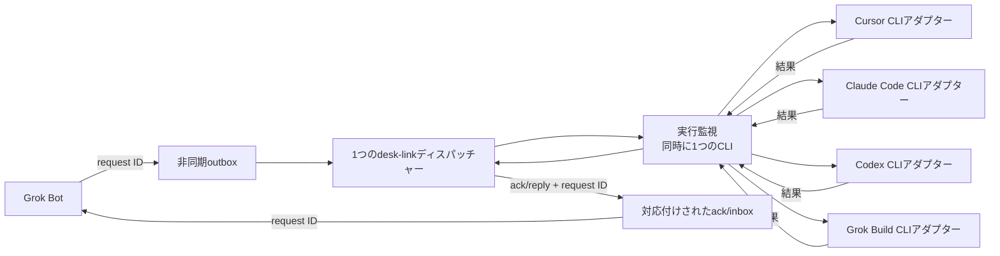

[English](architecture.md) | [日本語](architecture.ja.md) | [README](../README.ja.md)

# desk-linkアーキテクチャ

Grok Botは、Cursor、Claude Code、Codex、Grok Buildに対する依頼の送信元であり、返答の受信先です。

## 配信フロー

outboxとack/inboxのキューは、非同期の境界を作ります。ディスパッチャーは完全な依頼を1件ずつ受け取ります。実行監視は、そのアダプターのCLIが返答するまで待機します。

1件の配信が動作中でも、独立したoutboxへの追加は続行できます。バスごとの実行ロックは、同時に動くCLIを1つに制限します。ディスパッチャーが異常終了しても、実行監視はCLIが終了するまでロックを保持し、別のロックがキュー操作を保護します。

Windowsでは、これらのロックに[`Global\\`カーネルオブジェクト名前空間](https://learn.microsoft.com/ja-jp/windows/win32/termserv/kernel-object-namespaces)を使います。そのため、同じバスを使う対話プロセスとsession 0のスケジュール実行は、同じロックを共有します。

## 1件の依頼で起きること

1. Grok Botが一意のrequest IDを持つ依頼をoutboxへ書き込みます。
2. ディスパッチャーが依頼を検証して取得し、開始確認を記録します。
3. 実行監視が実行ロックを取得し、選択した非対話CLIを指定ワークスペースで開始します。
4. 実行監視が結果を返し、ディスパッチャーが同じrequest IDを持つ完了確認と返答を記録します。

確認結果は、依頼の開始、成功、エラー終了を示します。返答は、CLIの成功結果を取得できた後だけに記録されます。

## 実行の境界

アダプターは、Cursor、Claude Code、Codex、Grok Buildの公式コマンドラインツールを利用します。Cursorは公式ランチャーを解決し、読み取り専用askモードで標準入力のプロンプトを読み取ります。ネイティブWindowsでは、現在のCursor CLIがsandboxを利用できないと報告するため、`--sandbox disabled`を指定します。これはベンダーが提供する読み取り専用境界であり、OSによる隔離ではありません。macOS／Linuxでは`--sandbox enabled`を指定します。

Claude Codeは、`--safe-mode`、空の組み込みツール集合、`dontAsk`、セッション永続化なしで標準入力のプロンプトを読み取ります。このメッセージ専用境界は、ベンダー側の認証・モデル選択・権限を維持しつつ、`CLAUDE.md`、スキル、プラグイン、フック、MCPサーバー、コマンド、エージェント、カスタマイズを無効にします。

Codexは、ユーザー設定とルールを無視する一時的な読み取り専用モードで標準入力を読み取ります。

Grok BuildはUTF-8プロンプトファイルと`dontAsk`を使い、すべてのモデルツールを拒否し、Web検索・サブエージェント・メモリーを無効化して読み取り専用プロファイルで実行し、自動更新を無効化します。Windows版GrokにはOSレベルのサンドボックスバックエンドがないため、拒否したツール呼び出しはOSによる隔離ではなく、通常のCLI起動・設定・セッション動作はベンダーの管理範囲です。

これらの実行はヘッドレス・非対話です。desk-linkは、表示中のチャットや既存の製品セッションへ配信しません。

## 関連リファレンス

イベント項目と配信保証は、[プロトコルリファレンス](protocol.ja.md)を参照してください。
