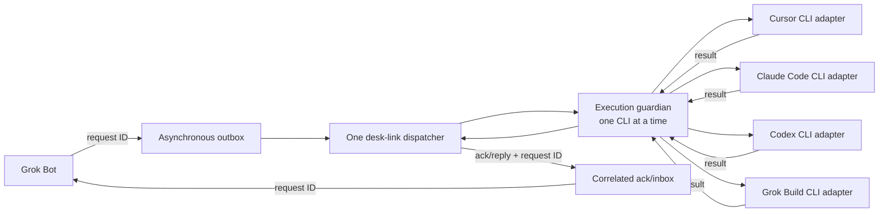

[English](architecture.md) | [日本語](architecture.ja.md) | [README](../README.md)

# desk-link architecture

Grok Bot is the request source and reply recipient for Cursor, Claude Code, Codex, and Grok Build.

## Delivery flow

The outbox and ack/inbox queues create asynchronous boundaries. The dispatcher takes one complete request at a time. An execution guardian blocks until that adapter's CLI returns.

Independent outbox enqueueing can continue while a delivery is active. A per-bus execution lease permits only one active CLI. If the dispatcher exits unexpectedly, the guardian keeps that lease until the CLI exits, while separate runtime locks protect queue operations.

On Windows, these locks use the [`Global\\` kernel-object namespace](https://learn.microsoft.com/en-us/windows/win32/termserv/kernel-object-namespaces). An interactive process and a session-0 scheduled process therefore use the same lock for the same bus.

## What happens to one request

1. Grok Bot writes a request with a unique request ID to the outbox.
2. The dispatcher validates and claims one request, then writes a started acknowledgement.
3. The execution guardian takes the execution lease and starts the selected non-interactive CLI in the requested workspace.
4. The guardian returns the result, and the dispatcher writes a terminal acknowledgement and a reply that carries the same request ID.

The acknowledgement reports whether the request started, finished successfully, or finished with an error. The reply is written only after a successful CLI result is available.

## Execution boundary

The adapters use the official Cursor, Claude Code, Codex, and Grok Build command-line tools. Cursor resolves its official launcher and reads its standard-input prompt in read-only ask mode. Native Windows explicitly uses `--sandbox disabled` because the current Cursor CLI reports that sandbox as unavailable there; this is a vendor-enforced read-only boundary, not operating-system containment. macOS and Linux use `--sandbox enabled`.

Claude Code reads its prompt from standard input with `--safe-mode`, an empty built-in tool set, `dontAsk`, and no session persistence. Its message-only boundary retains vendor authentication, model selection, and permissions while disabling `CLAUDE.md`, skills, plugins, hooks, MCP servers, commands, agents, and customizations.

Codex reads standard input in ephemeral, read-only mode while ignoring user configuration and rules.

Grok Build reads a UTF-8 prompt file with `dontAsk`, denies all model tools, disables web search, subagents, and memory, uses a read-only profile, and disables auto-update. On Windows, Grok has no OS-level sandbox backend, so its denied tool calls are not OS containment and its normal CLI startup, configuration, and session behavior remain vendor-owned.

These executions are headless and non-interactive. desk-link does not deliver into a visible chat or an existing product session.

## Related reference

For event fields and delivery guarantees, read the [protocol reference](protocol.md).
